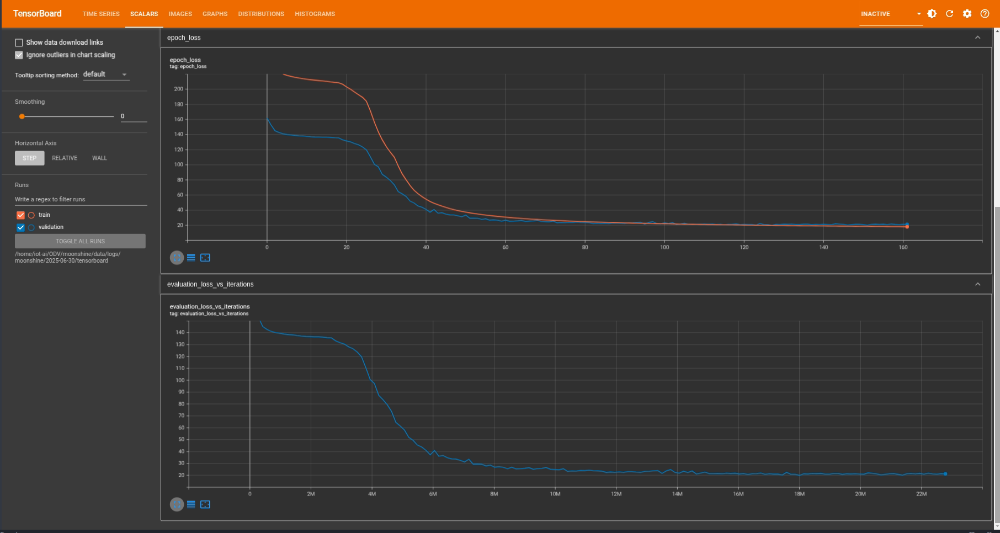

# Moonshine model in Tensorflow from scratch implementation

> **"Moonshine: Speech Recognition for Live Transcription and Voice Commands"**  
> [arXiv:2410.15608](https://arxiv.org/abs/2410.15608)

---

## 📝 Abstract

This repository presents a clean, from-scratch implementation of the **Moonshine** architecture in TensorFlow, inspired by the recent [Moonshine](https://arxiv.org/abs/2410.15608) model proposed for low-latency speech recognition on edge devices. This implementation focuses on reproducibility and compactness, targeting real-time transcription and command recognition on constrained hardware. It is trained and evaluated on the LibriSpeech dataset and includes support for log-Mel spectrogram input, multi-head attention, and causal decoding.

## 🎯 Objectives

- Reproduce the Moonshine model architecture entirely in TensorFlow 2.x.
- Train a lightweight version of the model from scratch on LibriSpeech.
- Evaluate its suitability for **real-time speech transcription** and **voice command applications**.
- Analyze training behavior through loss curves and benchmark performance.

## 📦 Model Architecture

The implementation consists of a modular encoder-decoder architecture with the following components:

- **Encoder**: Convolutional subsampling + Transformer blocks  
- **Decoder**: Causal Transformer Decoder  
- **Input**: Log-Mel Spectrograms (80 bins, 25ms window, 10ms stride)  
- **Output**: Character-level tokens  

## ModelArgs Hyperparameters

| Hyperparameter          | Value         | Description                                   |
|------------------------|---------------|-----------------------------------------------|
| `batch_size`           | 2             | Samples per gradient update                   |
| `epochs`               | 120           | Number of training epochs                     |
| `warmup_steps`         | 10000         | LR scheduler warmup                           |
| `dropout`              | 0.1           | Dropout rate                                  |
| `embeddings_dims`      | 256           | Token embedding dimensionality                |
| `no_of_heads`          | 8             | Attention heads in Transformer layers         |
| `no_of_decoder_layers` | 8             | Depth of decoder stack                        |
| `tgt_vocab_size`       | 31            | Size of output vocabulary (character-level)   |
| `kernel_size`          | 9             | Conv1D kernel size for subsampling            |
| `stride`               | 2             | Conv1D stride                                 |
| `log_mel_features`     | 80            | Log-mel feature bins                          |
| `sr`                   | 16000         | Sampling rate                                 |
| `window_duration`      | 0.025         | FFT window (25 ms)                            |
| `stride_duration`      | 0.010         | FFT stride (10 ms)                            |
| `window`               | Hann          | FFT windowing function                        |
| `n_channels`           | 1             | Spectrogram channels                          |
| `max_t`                | variable      | Input sequence length (time steps)            |
| `block_size`           | variable      | Output sequence length                        |

## 📊 Dataset

- **LibriSpeech 1000h**
- Preprocessing pipeline includes resampling, normalization, and log-mel spectrogram conversion using Hann windowing.

## 🧠 Training Details

- **Framework**: TensorFlow 2.x  
- **Optimizer**: Adam with custom LR scheduler (Noam-style warmup)  
- **Loss Function**: Cross-entropy with teacher forcing  
- **Training Duration**: 120 epochs (~140k steps/epoch)  
- **Device**: Trained on GPU (`cuda:0`)  

## 📈 Results

### Training and Validation Loss Curves

<p align="center">
  
</p>

- Training stabilized after ~100 epochs  
- Significant gap reduction between training and validation losses over time  

---

```bibtex
@misc{moonshine2024,
  title={Moonshine: Speech Recognition for Live Transcription and Voice Commands},
  author={Thomas B. Ash, Emilian Basarab, Lukas Mosser, Richard L. Mann},
  year={2024},
  eprint={2410.15608},
  archivePrefix={arXiv},
  primaryClass={cs.SD}
}
```